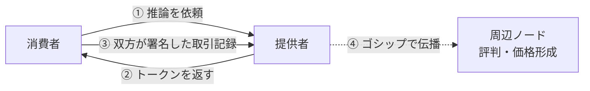

日本語版 | [English](README_EN.md)

# Tirami

[](https://crates.io/crates/tirami-core)
[](LICENSE)
[]()
[]()

Tirami は、ローカル LLM サーバーに計算資源の貸し借りを組み込んだ分散推論プロトコルです。

手元のマシンで推論を動かしつつ、モデルが載らないときは他のノードに依頼できます。
依頼した分は借りになり、他のノードの推論を引き受ければ返せます。
貸し借りの単位は FLOP で、1 TRM = 10⁹ FLOP として数えます。

> 💡 **まずは 1 台で試せます。** `tirami start` だけで OpenAI 互換 API が立ち上がります。
> 経済機能は使わなければ意識する必要はありません。

## ✨ 特長

- 🔗 **ブロックチェーンを使いません。** 取引は当事者 2 者が Ed25519 で相互署名するだけで確定します。ガス代も承認待ちもブロック生成時間もありません。台帳は HMAC-SHA256 で改竄を検出します。
- 🔑 **IP アドレスを知らなくても接続できます。** ノードの識別子は公開鍵（Ed25519）です。相手の居場所は [iroh](https://github.com/n0-computer/iroh) の分散 discovery が解決し、NAT の内側同士でもリレー経由で直接つながります。固定 IP・ポート開放・VPN は不要です。
- 🔌 **OpenAI 互換 API。** 既存のクライアントやライブラリをそのまま使えます。応答には `x_tirami` フィールドが付き、その推論に何 TRM かかったかが分かります。
- 📊 **TRM は投機トークンではありません。** 計算量そのものの単位（1 TRM = 10⁹ FLOP）です。ICO・プレマイン・運営取り分・エアドロップはいずれもありません。総供給量は 21B TRM です。
- 🖥 **主要な環境で動きます。** macOS（Apple Silicon の Metal は既定で有効）、Linux。推論エンジンは llama.cpp、モデルは GGUF 形式です。
- 🧪 **1,574 件のテストが通っています。** macOS arm64 × 2 と Linux x86_64 × 2 の計 4 ホストで、2 シード + 35 ワーカーを 24 時間以上動かして検証しています。

## 📦 インストール

```bash
git clone https://github.com/clearclown/tirami
cd tirami
cargo build --release
```

NVIDIA GPU を使う場合は `--features tirami-infer/cuda` を付けてビルドしてください。

## 🚀 使い方

### 1 台で動かす

```bash
./target/release/tirami start
```

モデルの取得、鍵の生成、API の起動まで自動で行われます。

```console
$ curl -s localhost:3000/v1/chat/completions \
    -H 'Content-Type: application/json' \
    -d '{"model":"qwen2.5:1.5b","messages":[{"role":"user","content":"こんにちは"}]}' \
  | jq '{content: .choices[0].message.content, x_tirami}'

{
  "content": "こんにちは！何かお手伝いできることはありますか？",
  "x_tirami": {
    "trm_cost": 47,
    "effective_balance": 953
  }
}
```

利用できるモデルは `smollm2:135m` `qwen2.5:0.5b`（既定）`1.5b` `3b` `7b` `14b` `32b` です。
任意の GGUF もローカルパス・HuggingFace URL・`org/repo/file.gguf` の形式で指定できます。

### ネットワークに参加する

モデルを持つ側（提供者）は、起動時に自分の公開鍵を表示します。

```console
$ ./target/release/tirami start --model qwen2.5:32b
Node ID: 3f8a1c4e...9e2b
```

借りる側はその公開鍵を指定するだけです。

```bash
./target/release/tirami start --bootstrap-peer 3f8a1c4e...9e2b
```

手元に 32B のモデルが無くても API は同じように使えます。
推論は提供者側で実行され、生成されたトークン量に応じた TRM が双方の署名付きで記録されます。

新規ノードには 1,000 TRM の無利子ローン（72 時間）が付きます。
提供者として継続的に稼ぐには一定額のステークが必要です（Sybil 対策）。

詳しい運用は [`docs/operator-guide.md`](docs/operator-guide.md) をご覧ください。

## 🚧 現在の開発状況

**複数のマシンのメモリを束ねて、1 台に載らないモデルを動かす機能はまだ実装されていません。**
現在の「モデルを持たないノード」は、依頼を提供者へ転送しています。
プロトコル定義と受信側は実装済みで、送信側のオーケストレーションが未着手です
（[#162](https://github.com/clearclown/tirami/issues/162) / [#163](https://github.com/clearclown/tirami/issues/163)）。最優先で取り組んでいます。

同一の所有者に属するノード間の取引を相殺してゼロにする仕組みも未実装です。
自宅の複数台をつないだだけで残高が動かないようにする予定です。

その他の実装状況は [`docs/release-readiness.md`](docs/release-readiness.md) に整理しています。

## 🏗 構成

```
crates/
├── tirami-cli      CLI
├── tirami-node     ノード本体・HTTP API・P2P パイプライン
├── tirami-net      iroh QUIC・discovery・クラスタ
├── tirami-proto    ワイヤプロトコル
├── tirami-infer    llama.cpp 推論エンジン
├── tirami-ledger   台帳・ステーク・価格・ガバナンス
├── tirami-shard    レイヤー分割の計画
└── tirami-sdk      Rust クライアント SDK
```



アーキテクチャの詳細は [`docs/architecture.md`](docs/architecture.md)、
経済モデルの設計は [`docs/whitepaper.md`](docs/whitepaper.md) をご覧ください。

## 🤝 貢献

Issue や Pull Request を歓迎しています。以下のような報告はとくに助かります。

- 経済モデルへの攻撃方法の指摘（「こうすれば TRM を不正に増やせる」というご指摘はいちばんありがたいです）
- P2P 接続が確立できなかった環境の報告（NAT の種類やネットワーク構成を添えていただけると助かります）
- お使いのハードウェア・OS・モデルの組み合わせでの動作報告

開発の手引きは [`AGENTS.md`](AGENTS.md)、セキュリティに関する報告方法は [`SECURITY.md`](SECURITY.md) にまとめています。

## 🙏 謝辞

推論基盤は [mesh-llm](https://github.com/Mesh-LLM/mesh-llm)（Michael Neale 氏、現在は Mesh-LLM organization にて開発）に由来します。
Tirami はその上に経済層を実装したものです。詳細は [CREDITS.md](CREDITS.md) をご覧ください。

## 📄 ライセンス

MIT License
