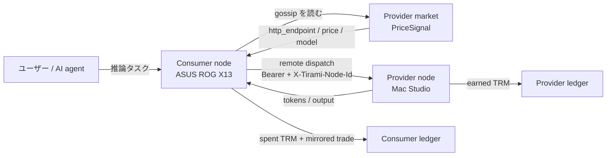
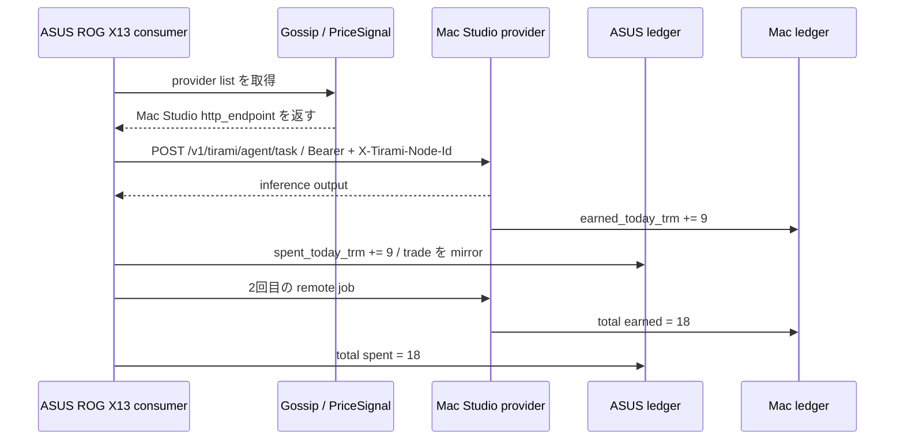
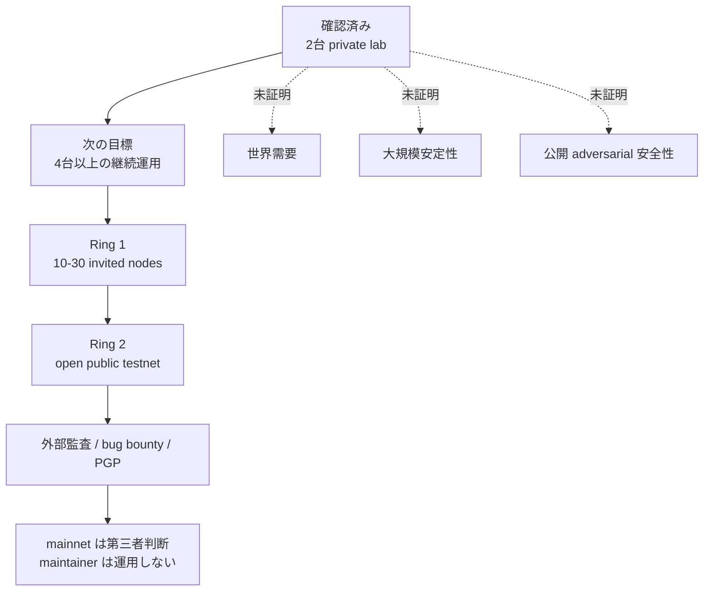

# Tirami 公開前ノート

**Status:** 2026-04-27. 2026-04-26 の2台 Tailscale 実験を踏まえた、
公開前の説明用ノート。投資勧誘ではなく、virtual TRM testnet の
技術・経済実験として読むこと。

## まず結論

Tirami は「余っている PC の計算を、AI agent が暗号化 P2P ネットワーク上で
買い、売り、記録する」ためのプロトコルである。

2026-04-26 の実験では、Mac Studio と ASUS ROG X13 の2台で以下を確認した。

- consumer agent が explicit peer hint なしで provider を自動選択した。
- provider は推論を返した。
- consumer 側に `spent_today_trm` が記録された。
- provider 側に `earned_today_trm` が記録された。
- 両方の ledger が同じ provider/consumer trade を保持した。
- restart 後も ledger と agent state が復元された。

これは「世界需要が証明された」ではない。正確には、
**世界需要を測るための最小ネットワークが動いた**という結果である。

## 図1: Tirami は何をしているか



Tirami の要点は、推論結果そのものだけではない。誰が計算を提供し、
誰が消費し、どれだけ TRM として記録されたかを、両側の ledger に残す点にある。

> **Note:** TRM は初期段階では「貨幣」ではなく、推論ジョブの内部会計単位である。
> 1 TRM = 10^9 FLOP という尺度を使い、計算量と支払いを結びつける。

## 図2: 2026-04-26 実験の流れ



観測値:

```text
Mac Studio agent: earned_today_trm = 18
ASUS agent:       spent_today_trm  = 18
Both ledgers:     total_trades = 2
```

## 図3: 何が完成していて、何が未完成か



現時点で言えること:

- private alpha として、remote agent の売買ループは動いている。
- 公開 testnet として健康とはまだ言えない。
- 本番級と呼ぶには、10+ nodes / 7+ days / daily jobs / restart recovery /
  failure settlement / metrics が必要。

## 4台で次に測ること

手元の候補:

| Machine | Address | Suggested role |
|---|---:|---|
| Current PC | `100.83.54.6` | operator console / optional node |
| Mac Studio | `100.112.10.128` | primary provider / seed |
| ASUS ROG X13 | `100.107.30.86` | consumer / cross-platform node |
| HP/Kali notebook | `100.82.83.122` | churn / low-power node after deps are fixed |

次の実験で取るべき指標:

| Metric | Why it matters |
|---|---|
| `tasks_success / tasks_total` | remote inference が実用的に成功するか |
| p50 / p95 latency | user 体験に耐えるか |
| ledger mismatch count | provider / consumer の会計がずれないか |
| restart recovery time | node を落としても復旧できるか |
| memory / disk growth | 7日運用で膨らみすぎないか |
| gossip convergence time | provider discovery が遅すぎないか |
| operator manual interventions | 人間がどれだけ介入したか |

## note.com に載せる短縮版

タイトル案:

> Tirami: 余っている PC の計算を AI agent が買い合うネットワーク

本文案:

> Tirami は、余っている PC の計算資源を AI 推論に使い、その仕事量を
> TRM という内部会計単位で記録するプロトコルです。Bitcoin が無目的な
> hash 計算を価値の根拠にしたのに対し、Tirami は実際に誰かが必要とした
> 推論計算を価値の根拠にします。
>
> 2026-04-26 に、Mac Studio と ASUS ROG X13 の2台を Tailscale 上で接続し、
> agent が peer を明示せずに provider を選び、remote inference を実行し、
> consumer 側の支出と provider 側の収益を両方の ledger に記録するところまで
> 確認しました。2回の remote job 後、Mac Studio は 18 TRM を earn し、
> ASUS は 18 TRM を spend しました。restart 後も ledger は復元されました。
>
> ただし、これは「世界需要が証明された」という意味ではありません。
> 正確には「世界需要を測るための最小ネットワークが動いた」という段階です。
> 次は 4台、10台、7日間の継続運用で、成功率、遅延、ledger の一致、restart
> recovery、failure settlement を測ります。

## 公開時に避ける表現

- TRM は投資対象です。
- 世界通貨が完成しました。
- これで絶対に儲かります。
- 完全自律経済が完成しました。

## 公開時に使う表現

- TRM は推論ジョブの内部会計単位です。
- 現在は virtual TRM testnet です。
- 2台 private lab で remote agent spend/earn を確認しました。
- open public testnet には 10+ node / 7+ day run が必要です。
- mainnet や二次市場は maintainer が運用・宣伝・追跡するものではありません。
